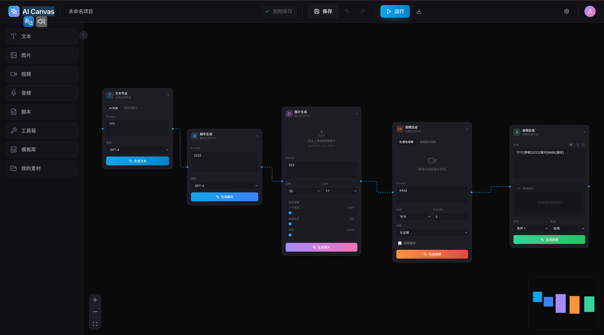
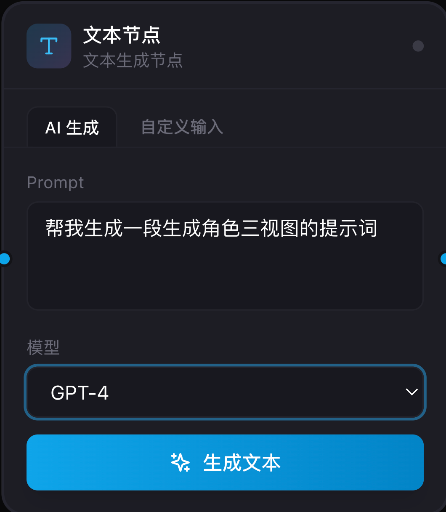
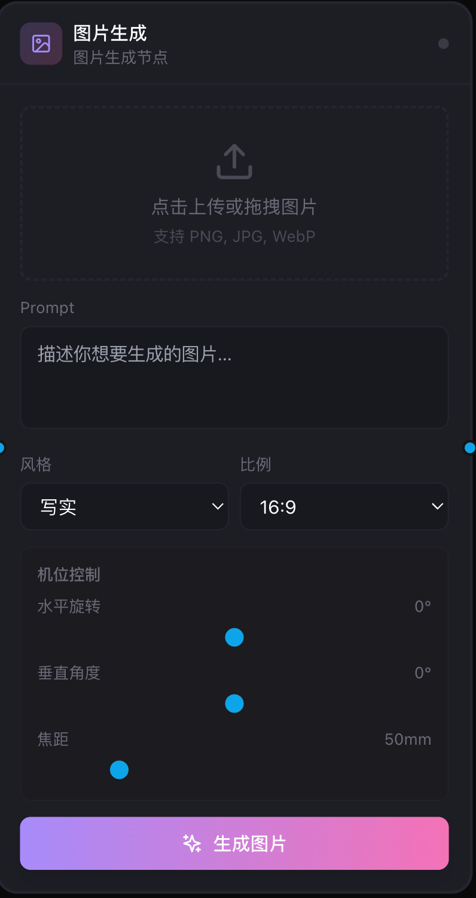
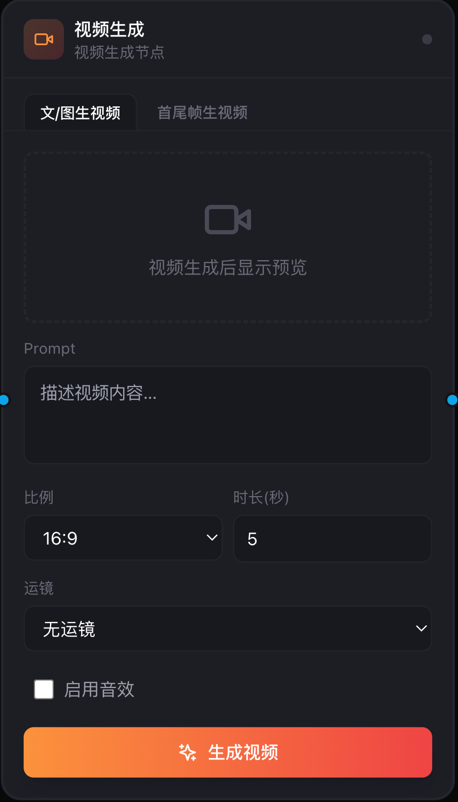
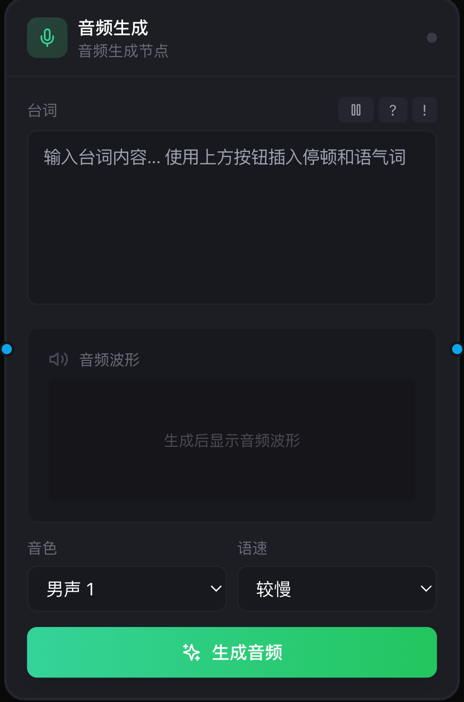

# AI Canvas - 智能创作工作台

<div align="center">


**一个现代化的 AI 创作工作台**

[](https://reactjs.org/)
[](https://www.typescriptlang.org/)
[](https://vitejs.dev/)
[](https://tailwindcss.com/)
[](LICENSE)

[English](README.md) · [简体中文](README_CN.md) · [在线演示](https://sestid.github.io/AI-Canvas/) · [报告问题](https://github.com/Sestid/AI-Canvas/issues)

</div>

---

## 📸 项目预览

<div align="center">
  
</div>

### 主界面
> 现代化的深色主题界面，提供沉浸式的创作体验



### 节点系统
> 六种强大的节点类型，满足各种 AI 创作需求

<table>
  <tr>
    <td width="50%">
      
      <p align="center"><b>文本节点</b> - AI 文本生成</p>
    </td>
    <td width="50%">
      
      <p align="center"><b>图片节点</b> - AI 图片生成</p>
    </td>
  </tr>
  <tr>
    <td width="50%">
      
      <p align="center"><b>视频节点</b> - AI 视频生成</p>
    </td>
    <td width="50%">
      
      <p align="center"><b>音频节点</b> - AI 音频生成</p>
    </td>
  </tr>
</table>

### 无限画布
> 基于 React Flow 的无限画布，支持自由拖拽、缩放和连线

---

## ✨ 特性亮点

### 🎨 核心功能

- **🖼️ 无限画布** - 基于 [React Flow](https://reactflow.dev/) 的专业级画布系统
- **🧩 六大节点** - 文本、图片、视频、音频、脚本、工具箱
- **🔗 智能连线** - 可视化工作流编排，直观展示数据流向
- **💾 自动保存** - 实时保存到本地，永不丢失创作进度
- **⌨️ 快捷键** - 高效的快捷键支持，提升创作效率
- **📤 导出功能** - 一键导出为 JSON 格式，便于分享和备份

### 🎯 节点能力

#### 📝 文本节点
- ✅ AI 生成模式（支持 GPT-4、Claude 等模型）
- ✅ 自定义输入模式
- ✅ 实时预览生成结果

#### 🖼️ 图片节点
- ✅ Prompt 驱动的图片生成
- ✅ 多种风格选择（写实、动漫、油画、水彩、3D）
- ✅ 高级机位控制（水平旋转、垂直角度、焦距）
- ✅ 自定义比例和分辨率
- ✅ 图片上传和预览

#### 🎬 视频节点
- ✅ 文/图生视频模式
- ✅ 首尾帧生视频模式
- ✅ 丰富的运镜选择
- ✅ 视频参数配置（比例、时长、分辨率）
- ✅ 音效开关

#### 🎵 音频节点
- ✅ 台词输入和编辑
- ✅ 停顿标记插入
- ✅ 语气词添加
- ✅ 音色和语速调节
- ✅ 音频波形预览

#### 📄 脚本节点
- ✅ Prompt 驱动的脚本生成
- ✅ 多模型支持
- ✅ 生成结果实时预览

#### 🛠️ 工具箱节点
- ✅ 角色三视图生成
- ✅ 多机位九宫格
- ✅ 剧情推演四宫格

### 🎨 设计特色

- **🌓 毛玻璃效果** - 现代化的 `backdrop-blur` 效果
- **✨ 流畅动画** - 基于 Framer Motion 的微动效
- **🎯 精致交互** - 细腻的 Hover 和 Focus 状态
- **📱 响应式布局** - 适配各种屏幕尺寸
- **🎨 高级配色** - 专业的深色主题配色方案

---

## 🚀 快速开始

### 环境要求

- **Node.js**: >= 18.0.0
- **npm** 或 **pnpm** 或 **yarn**

### 安装

```bash
# 克隆项目
git clone https://github.com/Sestid/AI-Canvas.git
cd ai-canvas

# 安装依赖
npm install
# 或者使用 pnpm
pnpm install
# 或者使用 yarn
yarn install
```

### 运行开发服务器

```bash
npm run dev
```

访问 [http://localhost:3000](http://localhost:3000) 查看应用

### 构建生产版本

```bash
npm run build
```

### 预览生产构建

```bash
npm run preview
```

---

## ⌨️ 快捷键

| 快捷键 | 功能 |
|--------|------|
| `⌘/Ctrl + K` | 打开命令面板 |
| `⌘/Ctrl + S` | 手动保存画布 |
| `Delete/Backspace` | 删除选中节点 |
| `ESC` | 取消选择 |
| 拖拽节点 | 从左侧拖拽节点到画布 |
| 右键菜单 | 快速操作节点 |

---

## 📁 项目结构

```
ai-canvas/
├── src/
│   ├── components/          # React 组件
│   │   ├── Header/         # 顶部导航栏
│   │   ├── Sidebar/        # 左侧工具栏
│   │   ├── Canvas/         # 画布区域
│   │   ├── Nodes/          # 自定义节点组件
│   │   │   ├── TextNode/
│   │   │   ├── ImageNode/
│   │   │   ├── VideoNode/
│   │   │   ├── AudioNode/
│   │   │   ├── ScriptNode/
│   │   │   └── ToolNode/
│   │   └── CommandPalette/ # 命令面板
│   ├── stores/             # MobX 状态管理
│   │   ├── canvasStore.ts  # 画布状态
│   │   ├── historyStore.ts # 历史记录
│   │   └── uiStore.ts      # UI 状态
│   ├── hooks/              # 自定义 Hooks
│   ├── types/              # TypeScript 类型定义
│   ├── utils/              # 工具函数
│   ├── App.tsx             # 根组件
│   ├── main.tsx            # 应用入口
│   └── index.css           # 全局样式
├── public/                 # 静态资源
├── docs/                   # 文档和截图
│   └── images/            # README 图片
├── index.html
├── package.json
├── tsconfig.json
├── vite.config.ts
├── tailwind.config.js
└── postcss.config.js
```

---

## 🎯 技术栈

### 核心框架
- **[React 18](https://reactjs.org/)** - 用户界面库
- **[TypeScript](https://www.typescriptlang.org/)** - 类型安全
- **[Vite](https://vitejs.dev/)** - 下一代前端构建工具

### UI & 样式
- **[TailwindCSS](https://tailwindcss.com/)** - 实用优先的 CSS 框架
- **[Framer Motion](https://www.framer.com/motion/)** - 动画库
- **[Lucide React](https://lucide.dev/)** - 图标库
- **[Ant Design](https://ant.design/)** - UI 组件库

### 画布 & 状态管理
- **[React Flow](https://reactflow.dev/)** - 流程图和节点编辑器
- **[MobX](https://mobx.js.org/)** - 简单、可扩展的状态管理

---

## 🏗️ 架构设计

### 状态管理

项目使用 **MobX** 管理全局状态，主要包含三个 Store：

```typescript
// 1. CanvasStore - 画布状态
class CanvasStore {
  nodes: CustomNode[]        // 节点列表
  edges: CustomEdge[]        // 连线列表
  selectedNodeId: string     // 选中的节点

  addNode()                  // 添加节点
  deleteNode()               // 删除节点
  updateNode()               // 更新节点
  saveToStorage()            // 保存到本地
}

// 2. HistoryStore - 历史记录
class HistoryStore {
  undo()                     // 撤销
  redo()                     // 重做
  canUndo: boolean          // 是否可撤销
  canRedo: boolean          // 是否可重做
}

// 3. UIStore - UI 状态
class UIStore {
  isSidebarOpen: boolean    // 侧边栏状态
  isCommandPaletteOpen: boolean  // 命令面板状态
  contextMenu: ContextMenu   // 右键菜单
}
```

### 数据流

```
用户操作 → Store 更新 (MobX) → 组件自动重渲染 (observer) → UI 更新
```

### 节点系统

所有节点都继承自 React Flow 的基础 Node 类型，使用 TypeScript 确保类型安全：

```typescript
interface CustomNode<T = any> extends Node {
  id: string
  type: NodeType
  position: { x: number; y: number }
  data: T & {
    label: string
    status: 'idle' | 'processing' | 'completed' | 'error'
    createdAt: number
    updatedAt: number
  }
}
```

---

## 🎨 设计规范

### 配色方案

```css
/* 主色调 */
--primary: #0ea5e9       /* Sky Blue */
--accent-purple: #a78bfa /* Purple */
--accent-pink: #f472b6   /* Pink */
--accent-green: #34d399  /* Green */
--accent-orange: #fb923c /* Orange */

/* 深色背景 */
--dark-950: #0a0a0c
--dark-900: #111113
--dark-800: #1a1a1d
--dark-700: #27272a
```

### 设计原则

1. **专业感** - 对标 Figma、Linear、Midjourney 的专业级 UI
2. **层次感** - 使用 backdrop-blur 和阴影营造深度
3. **流畅性** - 微动效提升交互体验
4. **易用性** - 符合直觉的操作逻辑

---

## 📝 开发指南

### 添加新节点

1. 在 `src/components/Nodes/` 创建节点组件
2. 在 `src/types/nodes.ts` 添加类型定义
3. 在 `src/stores/canvasStore.ts` 注册节点类型
4. 在 `src/components/Sidebar/Sidebar.tsx` 添加节点图标

示例：

```typescript
// 1. 创建节点组件
const MyNode = observer(({ id, data, selected }: NodeProps<MyNodeData>) => {
  return (
    <motion.div>
      {/* 节点内容 */}
    </motion.div>
  );
});

// 2. 添加类型定义
interface MyNodeData extends CustomNodeData {
  type: 'my-node';
  // 自定义字段
}

// 3. 注册节点
const nodeTypes = {
  'my-node': MyNode,
  // ...
};
```

### 最佳实践

- ✅ 使用 TypeScript 确保类型安全
- ✅ 组件遵循单一职责原则
- ✅ 使用 observer 包裹需要响应 Store 变化的组件
- ✅ 对交互元素添加 `onMouseDown`、`onPointerDown`、`onClick` 事件阻止冒泡
- ✅ 使用 `nodrag` 类名防止 React Flow 拖拽干扰

---

## 🚧 路线图

### 近期计划

- [ ] 完善 Undo/Redo 系统
- [ ] 节点模板库
- [ ] 批量导入/导出
- [ ] 快捷键自定义
- [ ] 亮色主题支持

### 长期计划

- [ ] 自动布局算法（Dagre/ELK）
- [ ] 协同编辑（WebRTC/WebSocket）
- [ ] AI 自动生成工作流
- [ ] 插件系统
- [ ] 云端保存和同步
- [ ] 移动端适配
- [ ] 多语言支持（i18n）

---

## 🤝 贡献

欢迎贡献代码、报告问题或提出建议！

### 如何贡献

1. Fork 本仓库
2. 创建你的特性分支 (`git checkout -b feature/AmazingFeature`)
3. 提交你的更改 (`git commit -m 'Add some AmazingFeature'`)
4. 推送到分支 (`git push origin feature/AmazingFeature`)
5. 打开一个 Pull Request

### 开发规范

- 遵循 ESLint 和 Prettier 配置
- 提交信息使用 [Conventional Commits](https://www.conventionalcommits.org/)
- 添加必要的注释和文档

---

## 📄 许可证

本项目基于 [MIT License](LICENSE) 开源。

---

## 🙏 致谢

- [React Flow](https://reactflow.dev/) - 强大的流程图库
- [TailwindCSS](https://tailwindcss.com/) - 优秀的 CSS 框架
- [Framer Motion](https://www.framer.com/motion/) - 流畅的动画库
- [LibTV Canvas](https://libtv.com/) - 设计灵感来源

---

## 📮 联系方式

- **作者**: Sestid
- **邮箱**: sestid@163.com
- **GitHub**: [@史春雨](https://github.com/Sestid)
- **个人博客**: [@Sestid](https://blog.csdn.net/Sestid)

---

<div align="center">

**⭐ 如果这个项目对你有帮助，请给一个 Star！⭐**

Made with ❤️ by [Sestid]

[⬆ 回到顶部](#ai-canvas---智能创作工作台)

</div>
